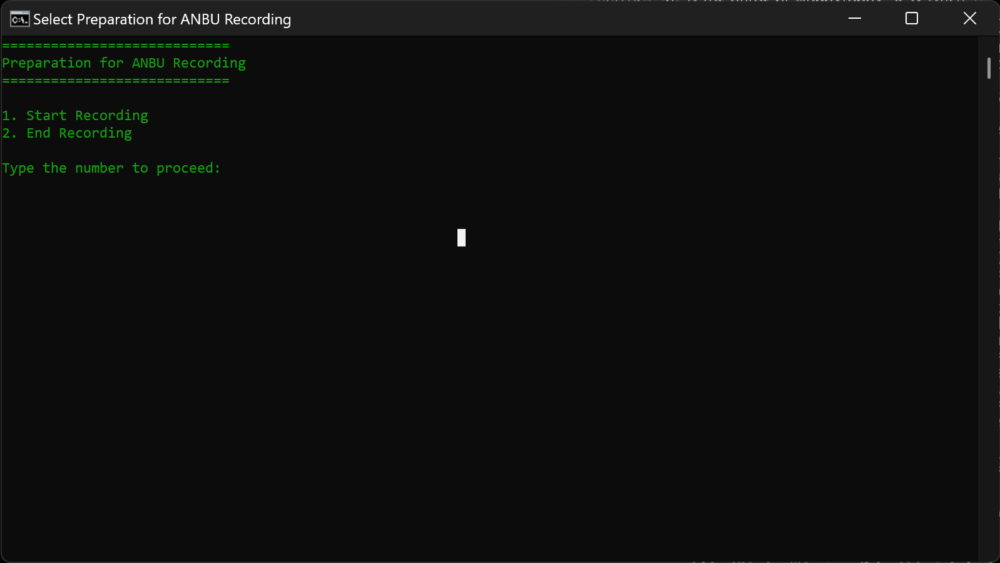

# ⏺️ Recording Preparation tool.

This is simple tool to enable few presentation tools automatically.

### Screenshot 🪧

### This will do the following

**Start/End the Recording**

- Open/End Nvidia broadcast software (Which means you have to install it.)
- Open OBS Studio
- Open Cursor Highlighter
- Change your screen resolution to 250% (If you are using 4K Monitor)

### How to use?

- Run the `prepare-recording.bat` file and it will ask you two options, select which you want to do and it will do it as you said. 😊

### License: **MIT**

### Author: **Anbuselvan Rocky**
